# 概述

嗨.音乐是一个前后端分离的音乐主题类网站，具有热门榜单，歌单、歌曲、歌手、MV模块，用户可听歌、搜索相关歌曲、MV，发布歌单等功能。

#  技术栈

1. 后端：SpringBoot、MyBatis-Plus、MySQL
2. 前端：Vue2 VueRouter Vuex 

#  系统设计

服务接口接收前台管理的Axios请求后，返回数据，前台页面接收数据进行数据的渲染。服务接口接收后台管理的Axios请求后，返回数据，完成页面的初始渲染，后台管理人员操作具体的更新记录，发起Axios请求，服务接口接收请求，执行对应的方法，使数据库中的数据改变。服务接口通过JDBC操作数据库，实现数据的查询和更新。

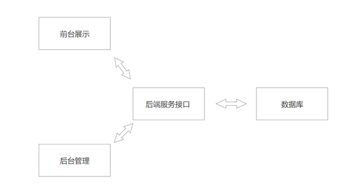

##  功能模块

系统的功能模块分成两部分：前台和后台

在前台页面功能主要为用户注册登录，用户浏览歌单、MV、歌曲、歌手的信息，用户播放歌曲、观看MV，用户对歌单、MV、歌曲进行评论，搜索歌曲、歌手、歌单、MV信息，系统推荐歌单、歌曲、歌手、MV信息，我的音乐。前台功能模块图如图2-1所示。

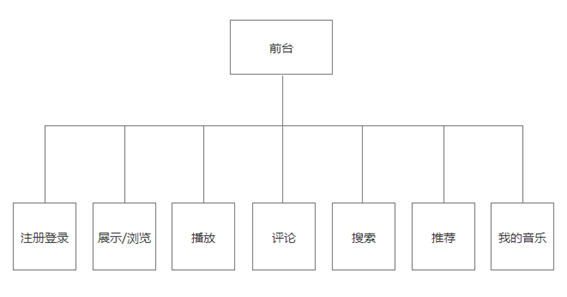

后台页面管理的功能模块分成两部分：用户管理和内容管理。用户管理对普通用户、歌手、审核员、管理员进行管理。内容管理对歌曲、MV、歌单、评论进行管理。后台功能模块图如图2-2所示。

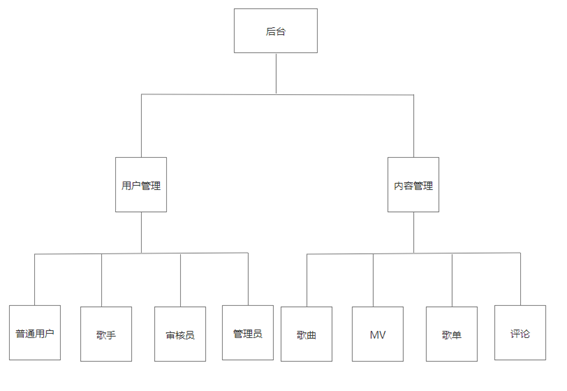

##  数据库设计E-R图

用户发布

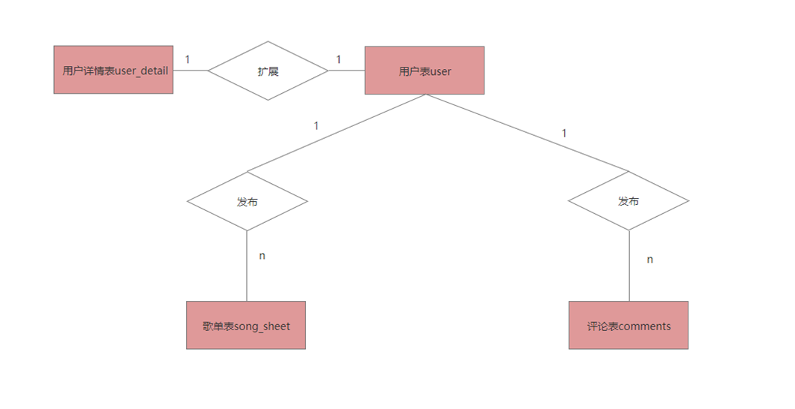

歌手发布

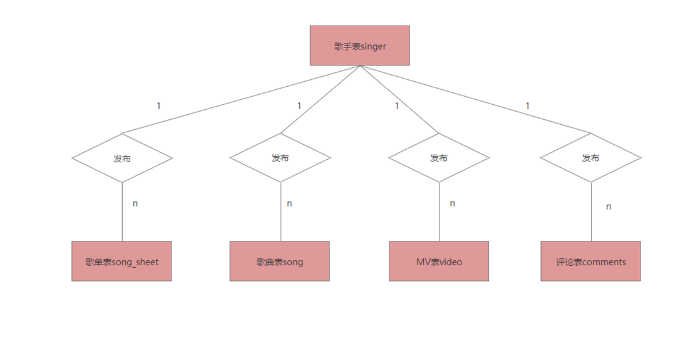

评论关联

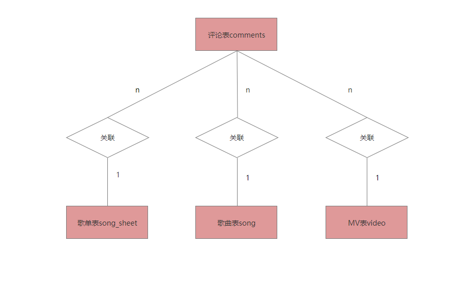

用户管理

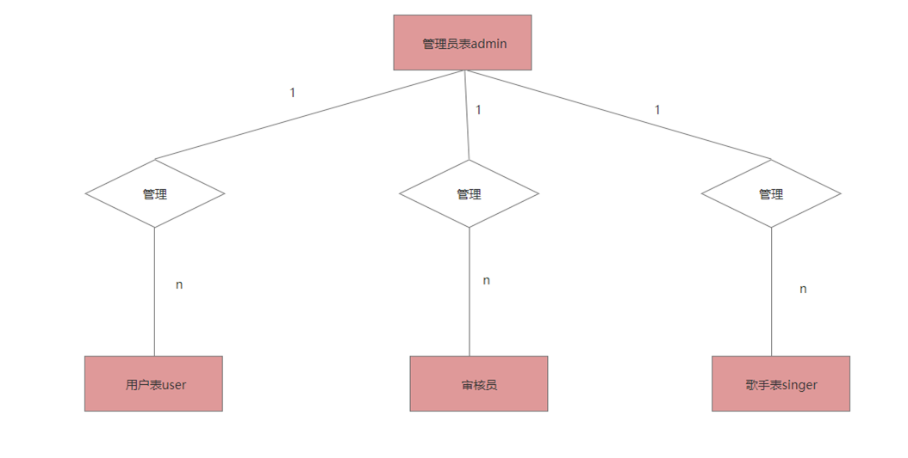

内容审核

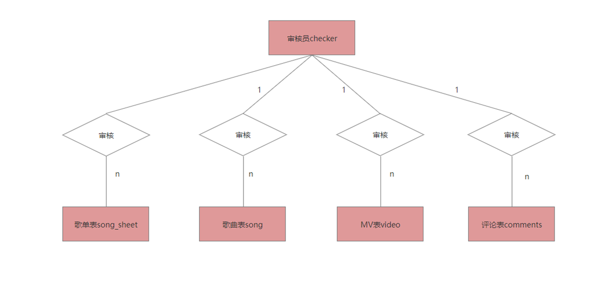

#  页面展示

首页

注册登录

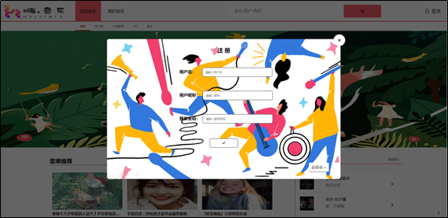

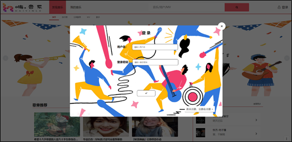

歌曲

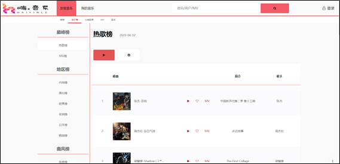

歌单

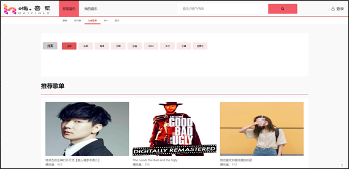

MV

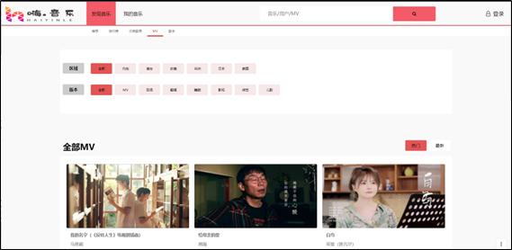

歌手

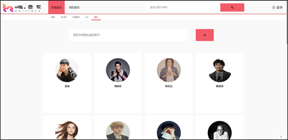

歌单详情

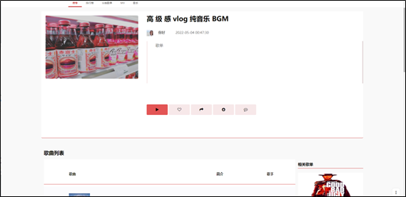

MV详情

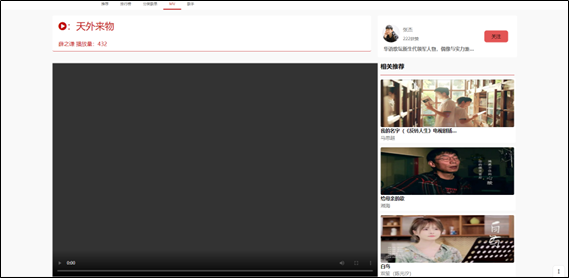

歌手详情

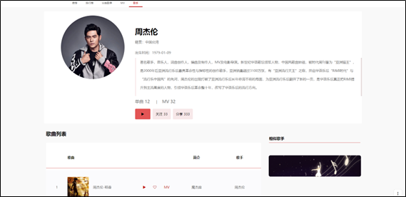

歌曲详情

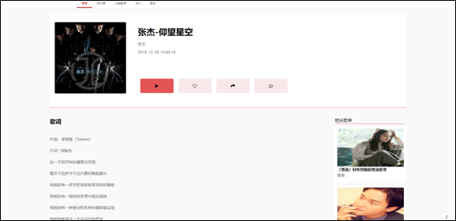

播放器详情

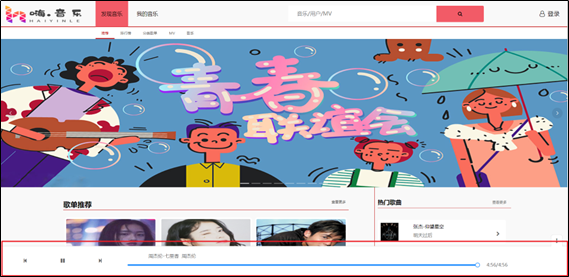

#  本地运行

请打开子文件夹的 `README.md` 文件进行查看。

#  反馈

如果您有任何反馈，请通过发送至[电子邮件](mailto:workyyx@163.com)与我联系/或者提交`issues` 。
